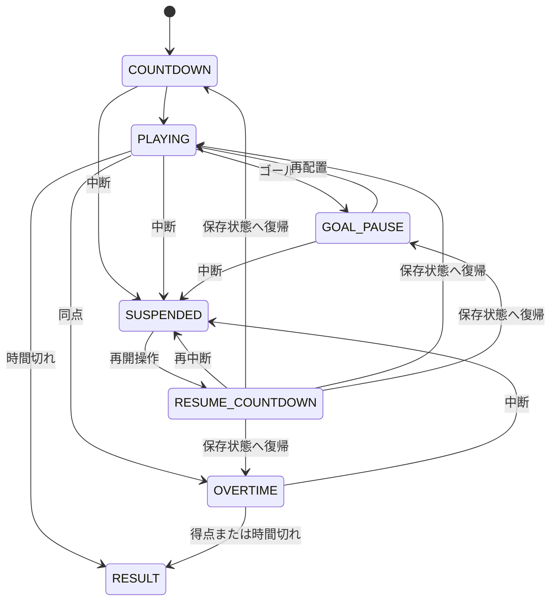

# ホケット：リッチなブラウザゲーム実装計画書

| 項目 | 内容 |
|---|---|
| 文書状態 | 実装開始前の基準案 |
| 対象 | iPhoneを最優先にした縦画面の1人用ブラウザゲーム |
| 初期公開先 | GitHub Pages |
| 初版 | 2026-08-13 |
| 更新規則 | 仕様を変えたら「決定記録」と変更履歴も同時に更新する |

## 0. 結論

『ホケット』は、画面下の発射装置から弾を撃ち、弾でパックを押して画面上のゴールへ入れる「90秒の卓上電磁スポーツ」として作る。パックを直接動かせないことと、射撃後に約0.9秒待つことが中心となる。連打ではなく、パックの未来位置を読み、攻撃に撃つか守備に残すかを決めるゲームにする。

初期公開版は、チュートリアル、CPU戦、3つの盤面、2段階の難易度、終盤15秒の予告付き変化、結果と即再戦までに絞る。オンライン対戦、利用者登録、全体ランキング、課金、3D化は作らない。

見た目は、真夜中の町工場で廃材から組み上げた電磁競技盤を主題にする。既存作品から借りるのは「弾をパックへ当てて動かす」という抽象的な着想だけとし、固有の人物、名称、絵、音、物語、盤面配置は使わない。

実装は、描画・入力・音をPhaserへ任せ、試合結果を決める物理計算とCPU判断を純粋なTypeScriptとして分ける。物理計算は1秒を120回に分けて一定間隔で進め、高速な弾がパックを通り抜けない衝突判定を採用する。こうすると、端末の描画速度が変わっても勝敗が変わりにくく、自動試験もしやすい。

## 1. 調査で確認できた事実と本作での提案

事実と提案を混ぜると、後から「何を守るべきか」が分からなくなる。この文書では次のように分ける。

### 1.1 確認できた事実

- 参考作品『クレイマン ガンホッケー』は、1999年11月25日にPlayStation向けに発売されたアクション作品である。[ファミ通](https://www.famitsu.com/game/title/18944/page/1)
- 参考作品は、ラケットではなく両端の銃でパックを撃つエアホッケーの変形である。[TASVideos](https://tasvideos.org/3964G)
- 外部レビューでは、複数パック、ゴールを守る効果、速度変化などがあり、時間終了時の得点で勝敗を決める一方、自動照準を含む単純さが弱点として挙げられている。[Hardcore Gaming 101](https://www.hardcoregaming101.net/klaymen-gun-hockey/)
- GitHub Pagesは、HTML、CSS、JavaScriptを公開できる静的な公開サービスである。公開元にはブランチまたはGitHub Actionsを選べる。[GitHub Docs](https://docs.github.com/en/pages/getting-started-with-github-pages/configuring-a-publishing-source-for-your-github-pages-site)
- iPhoneのSafariは、Web標準の振動機能に対応していない。そのため、振動を主要な手応えにはできない。[MDN: Navigator.vibrate](https://developer.mozilla.org/en-US/docs/Web/API/Navigator/vibrate)

### 1.2 本作で採用する提案

参考作品の自動照準は採用しない。プレイヤーがタップした位置へ弾を飛ばし、命中位置と反射方向を予測できる形にする。特殊効果は無作為に配らず、予告付きの盤面ルールとして扱う。結果の偶然性を減らし、「自分の一発で流れを変えた」と理解できる作品を目指す。

以下の数値、世界観、画面構成、開発段階はすべて『ホケット』独自の実装提案である。試遊前の数値は仮説であり、合格範囲を外れた場合は変更する。

## 2. 作品の目標と守る約束

### 2.1 一文で表す作品

> 一発ごとに盤面の流れを変える、90秒の卓上電磁スポーツ。

### 2.2 体験の柱

| 柱 | プレイヤーが感じること | 実装で守ること |
|---|---|---|
| 一発の重さ | 今撃つか、守りに残すかを迷う | 射撃後に待ち時間を設け、残り時間を砲台の輪で見せる |
| 力のつながり | 自分の弾がパックを動かしたと分かる | 弾の軌跡、命中の輪、パックの短い残像を同じ系統の色でつなぐ |
| 読める反射 | 壁や反射板を使って上達できる | 自動補正を隠さず、衝突と反射を一定の規則にする |
| 短い再挑戦 | 負けても、次の一発を試したくなる | 結果から1回の操作で同じ条件へ再戦できる |

### 2.3 対象と遊ぶ場面

主な対象は、iPhoneで1～3分だけ遊びたい人と、簡単な操作の中にも狙いと判断を求める人とする。最初の10秒で発射と命中を体験させ、説明を読み切らないと始められない構成にはしない。

対応の優先順位は次のとおり。

1. iPhone 13のSafari、縦向き。性能合格の暫定下限にする
2. iPhone SE相当の375×667 CSSピクセル、縦向き。表示合格の下限にする
3. 公開時点の新しいiPhone、iPad、一般的なスマートフォン
4. パソコンのChrome、Safari、Firefox

P0で実際に確保できるiPhoneの機種とOSを記録する。iPhone 13実機を確保できない場合は、同等以下の端末で代替するか、P2の性能判定を保留にし、より高速な端末の結果だけで合格とはしない。

横向きでは試合を止め、「縦向きに戻す」と表示する。メニューは使えるようにしても、横向き専用の盤面は初期版では作らない。

## 3. ゲームプロダクトマネージャー視点

### 3.1 初期公開の価値

初期公開で証明することは、コンテンツ量ではなく「射撃でパックを動かす90秒の対戦が、理解され、再戦されるか」である。豪華さは盤面数の多さではなく、撃つ、当たる、跳ね返る、入るという一連の反応を丁寧に作って出す。

### 3.2 初期公開に含めるもの

| 含める | 内容 |
|---|---|
| 基本導線 | 起動、ホーム、短い体験型説明、盤面と難易度の選択、試合、結果、再戦 |
| 試合 | 90秒、1～2パック、得点、同点延長、中断と復帰 |
| 盤面 | 障害物なし、対称ブロック、反射板の3種類 |
| CPU | 「れんしゅう」と「ふつう」の2段階 |
| 設定 | 効果音、音楽、動きを抑える表示、説明の再受講 |
| 保存 | 設定、説明完了、盤面解放、端末内の自己記録 |
| 品質 | 自動試験、GitHub Actions、GitHub Pages向けの公開処理、権利一覧 |

### 3.3 初期公開では作らないもの

オンライン対戦、利用者登録、サーバー保存、全体ランキング、課金、広告、物語モード、日替わり運営、盤面編集、3D化、常時3個以上のパックは対象外とする。「むずかしい」CPU、動くゲート、無作為なアイテム、試合の完全再生は公開後の候補へ回す。

### 3.4 成功を判断する数値

開発の成否を判断する数値を、成果指標（KPI）と呼ぶ。ここで使う10人の結果は、小規模な公開判断の材料であり、市場全体の需要や統計的な成功を証明するものではない。

サーバーを持たないため、公開利用者全体を自動集計することはしない。開発版だけが匿名の試遊結果を端末内に蓄積し、「試遊結果をコピー」から本人が共有できる形にする。個人名、広告用識別子、端末固有情報は記録しない。試遊前に記録項目を示して同意を得る。共有された記録の保管場所、90日を初期値とする保管期間、削除方法を `TEST_REPORT.md` に記す。

| 判断したいこと | 初期目標 | 記録する値 |
|---|---:|---|
| 操作が伝わるか | 初見10人中8人以上が30秒以内に初命中 | 最初の射撃と初命中までの秒数 |
| 1試合を終えられるか | 初回試合完了率90%以上 | 試合開始、終了、途中離脱 |
| 再戦したいか | 初回終了後30秒以内の再戦率60%以上 | 結果表示と再戦 |
| 標準CPUが一方的でないか | 説明後3試合のプレイヤー勝率40～60% | 勝敗、得失点、難易度 |
| 試合が壊れないか | 連続100試合で進行不能0件 | 終了理由、パック消失、例外 |

中心の指標は再戦率とする。操作できても再戦されない場合は、機能を増やす前に命中感、試合時間、射撃待ち時間、CPUの強さを見直す。

P2の5人は問題を早く見つける形成的試験、P3の初見10人は公開判断に使うパイロット試験として分ける。P3では、初見10人中8人の30秒以内初命中、9人以上の初回試合完了、6人以上の30秒以内再戦開始をすべて判定する。基本規則を説明できる人も10人中8人以上を必要とする。

標準CPUの勝率は、各参加者があらかじめ決めた3組の盤面と乱数で3試合ずつ遊ぶ計30試合を分母にする。提示順は参加者ごとに入れ替える。同じ人のやり直しを新しい標本には数えない。調整後は新しい初見参加者で確認することを優先し、同じ人を含む場合は分けて記録する。試合開始、完了、再戦開始、途中離脱の定義も `TEST_REPORT.md` に固定する。

### 3.5 範囲を固定する規則

後述のP2「完成見本」が通った時点で、初期公開の機能を固定する。それ以降の新機能は、同じ大きさの既存機能と入れ替える場合を除き、公開後へ送る。重大な不具合、理解できない表示、権利問題、性能不足の修正はこの制限に含めない。

P2の工数または性能予算を超える場合は、勝敗へ影響しない「最後の軌道」、端末内の自己記録、背景の装飾差分の順に外す。なお足りない場合だけ、リコシェ・レールを公開後へ送る案を別の判断として記録し、この文書の初期範囲とP3を同時に更新する。体験型説明、直接攻撃と守備、充電表示、得点、再戦、消音時の情報、復帰処理は削らない。

## 4. ゲームクリエイター視点

### 4.1 独自の世界観

舞台は、真夜中の町工場で始まった手のひらサイズの電磁スポーツとする。暗い作業台の上で、銅線、ねじ、磁石、古い表示灯から組み上げた競技盤が起動する。人物を前面に出さず、競技盤そのものを主役にする。

| ゲームの仕組み | 世界観の中での見せ方 |
|---|---|
| 発射後の待ち時間 | 発射装置が電気をため直す |
| 通常壁 | 廃材から作った外周レール |
| 障害物 | 作業台へ固定した万力ブロック |
| 反射板 | ばね付きの磨かれた金属板 |
| 2個目のパック | 過負荷で生まれる高出力コア |
| ゴール | パックを吸い込む電磁回収口 |

### 4.2 見た瞬間に伝える画面

画面はほぼ真上から見た構図にする。影と光で厚みを出すが、上側が細くなる強い遠近表現は使わない。見た位置と当たり判定のずれを防ぐためである。

プレイヤー側は青緑と丸い輪、CPU側は赤橙と二重の角形で示す。通常パックは白い円、高出力コアは琥珀色の六角形と数字「2」で分ける。色を消しても、形だけで区別できるようにする。

### 4.3 90秒の感情の流れ

| 時間 | 展開 | 演出 |
|---:|---|---|
| 0～5秒 | 盤面起動とカウント | 発射装置からゴールへ光が走り、すぐ操作可能になる |
| 5～30秒 | 一つのパックで基本を読む | 最初の強い命中だけを少し大きく見せる |
| 30～60秒 | 盤面固有の反射や障害物を使う | 外周表示灯が得点方向へ順番に点く |
| 60～73秒 | 終盤へ向けた競り合い | 音楽へ薄いリズムを一層足す |
| 73～75秒 | 高出力コアの出現予告 | 中央の出現地点と得点「2」を表示する |
| 75～90秒 | 2個のパックを選ぶ終盤 | 外周灯を速めるが、盤面全体の点滅はさせない |

結果では動画を再生せず、最後の得点に至った軌道を光の線として短く残す。少ない処理で「今の一発」を振り返れるようにする。

### 4.4 画面と音を同時に始める

iPhoneでは振動を前提にできないため、重要な意味は画面と音だけで成立させる。振動対応端末で後から補助的に使う場合も、振動がなくて不利にならないことを条件とする。

| 出来事 | 画面 | 音 |
|---|---|---|
| 発射 | 発射装置が短く後退し、充電輪が空になる | 低い機械音に短い電気音を重ねる |
| パック命中 | 接触方向へ輪を広げ、短い残像を付ける | 速度に応じて音程を少しだけ変える |
| 反射板命中 | 接触した部分だけ細く光らせる | 短い金属音を出す |
| 再発射可能 | 充電輪を閉じ、一度だけ明るくする | 小さな充電完了音を任意で出す |
| ゴール | 100～120ミリ秒だけ動きを止め、吸い込みと得点を見せる | 低音から短い明るい和音へつなぐ |

最初の起動時は消音とし、ホームに分かりやすい音の切り替えを置く。音を有効にする操作の中で音声処理を開始し、自動再生制限に従う。[MDN: Web Audioの自動再生](https://developer.mozilla.org/en-US/docs/Web/Media/Guides/Autoplay)

### 4.5 少ない素材で豊かに見せる

初期版では、盤面外装1種類、発射装置1種類、パック2種類、障害物4形状、小さな発光画像3種類を基本素材とする。色、点灯順、回転、部品の組み合わせで変化を作り、似た画像を大量に持たない。

音は、発射、パック命中、壁、反射板、充電完了、ゴール、画面操作の7系統を基本にする。音楽は通常と終盤を切り替えるのではなく、同じ長さの層を重ねる。切り替え地点で不自然に途切れないようにする。

### 4.6 演出の上限

通常命中では画面を揺らさない。強い衝突でも揺れは4論理ピクセル以内、120ミリ秒以内とする。全画面の白い点滅、常時の色ずれ、紙吹雪の連発は使わない。動きを抑える設定では、画面揺れ、拡大、強い残像を止める。端末の「視差効果を減らす」設定も検出し、初期値へ反映する。[MDN: prefers-reduced-motion](https://developer.mozilla.org/en-US/docs/Web/CSS/Reference/At-rules/%40media/prefers-reduced-motion)

点滅は1秒に3回を超えないようにし、公開候補では点滅の面積と明るさも確認する。[W3C: Three Flashes or Below Threshold](https://www.w3.org/WAI/WCAG22/Understanding/three-flashes-or-below-threshold.html)

## 5. ゲームデザイナー視点

### 5.1 中心となる遊び

中心は、パックの現在位置ではなく、弾が届くときの位置を読んで一発を置くことである。

`パックの位置と速さを見る → 当てる場所を決める → タップして撃つ → 衝突と反射を見る → 次の射撃を攻撃か守備へ使う → 得点 → すぐ次の判断へ戻る`

攻撃と守備を同じ入力で行う。相手ゴールへ向けて押せば攻撃、自陣へ向かうパックへ横から当てれば守備になる。正面が塞がれたときだけ、壁や反射板を使う。

### 5.2 画面と入力の確定規則

上端にCPUゴールとCPU発射装置、下端にプレイヤーゴールとプレイヤー発射装置を置く。発射装置はゴールラインの外に置き、物理的な壁にはしない。

| 場面 | 規則 |
|---|---|
| 射撃 | プレイ領域を1回タップすると、砲口からその地点へ弾を即座に撃つ |
| 狙える範囲 | 砲口より32以上前方の盤面内。外側は最寄りの有効地点へ丸める |
| 待ち時間中 | 射撃しない。入力を予約せず、充電輪で残りを見せる |
| 複数の指 | 最初の1本だけを受け付け、2本目以降は無視する |
| 弾 | パックへ1回当たると消える。通常壁と障害物でも消え、反射板だけ1回跳ね返れる |
| パック | 壁、障害物、反射板で跳ね返る。パック同士は衝突する |
| 高出力コア | 見た目は六角形だが、通常パックと同じ半径14の円として衝突を判定する |
| 弾同士 | 互いにすり抜ける。不要な偶然を増やさない |
| 得点 | パック全体がゴールラインを越えた固定更新で成立する |
| 自陣ゴール | 最後に誰が触れたかを問わず、相手の得点になる |
| 中断 | 画面が隠れたら時計、物理、充電を止める。復帰可能になった後、「再開」の操作を受けて3秒数えて戻る |

試合画面では、得点を上部左右、残り時間を上部中央へ置く。画面下で指に隠れる場所へ重要情報を置かない。射撃できる領域と設定ボタンを重ねない。

### 5.3 試合規則

| 項目 | 初期仕様 |
|---|---|
| 通常時間 | 90秒。得点演出と再配置中は時計を止める |
| 通常パック | ゴールで1点 |
| 高出力コア | 残り15秒に予告付きで追加し、ゴールで2点 |
| 同時存在数 | 最大2個 |
| 得点後 | 0.8秒の得点演出後、全弾を消してパックを再配置する。両者の充電を満タンにする |
| 時間切れ | 最終更新内の全得点を加算してから勝敗または延長を決め、その後は物理を進めない |
| 同点 | 15秒の延長。1パックへ戻し、両ゴールを20%広げ、先取1点で終了 |
| 延長も無得点 | 引き分け |

2点の技巧ボーナスは作らない。勝敗点は、見た目で1点か2点か分かるパックだけに結び付ける。反射回数や強い命中は結果画面の小さな記録にしても、勝敗には加えない。

通常時間は10,800固定更新、延長は1,800固定更新で管理する。各更新は、前の更新で予約されたイベントの適用、連続衝突とゴール通過時刻の計算、同じ更新内の全得点の集計と再配置、残り更新数の減算、その残り時間で起動するイベントの適用、状態遷移の順に処理する。同時に双方へ入った場合も、一方を物体番号で捨てず、すべての得点を加える。得点演出はまとめて1回だけ行う。

高出力コアは、残り時間が17秒になった更新の終了時に予告し、15秒になった更新の終了時に通常パックと重ならない固定位置へ出す。新しいコアが物理へ参加するのは次の更新からとする。得点処理と出現が同じ更新に重なった場合は、得点と再配置を終えてから出す。得点後は通常パックと高出力コアの両方を再配置し、2点の性質を保つ。延長開始時には高出力コアを除く。

再配置の座標、初速度、重なりを解く順序、発射装置の充電状態は盤面データへ明記し、180度回転対称にする。0.8秒の得点演出では、最初の100～120ミリ秒だけ物理表示を完全に止め、残りは勝敗へ影響しない吸い込みと再配置の演出に使う。

### 5.4 膠着と暴走を防ぐ規則

パックの速さが24/秒未満のまま180固定更新続いた場合は、60固定更新の発光予告を始める。予告中に24/秒以上へ戻った場合は、予告と低速カウンタを取り消す。予告終了時にも低速なら、速度ベクトルへ中心向きの速度差分120/秒を1回加える。中心から1論理ピクセル以内では上下どちらにも有利にならない水平方向を使い、左右は試合の乱数と物体番号から一意に決める。

全パックが2,400固定更新のあいだ得点しなかった場合は、盤面中央から見える波を1回出し、各パックの速度ベクトルへ中心向きの速度差分160/秒を1回加える。中心から1論理ピクセル以内では、低速解除と同じ水平方向の規則を使う。波を出した時点で無得点カウンタを0へ戻す。得点時にも数え直すため、同じ条件で連続発生しない。

物理上の速さは、すべての衝突と加力の後に600/秒へ必ず制限し、状態値を上限超過のまま残さない。急な見た目を和らげる場合は描画補間だけで行う。角へ完全に入り込む配置は自動試験で除外する。

### 5.5 初期数値は仮説として扱う

| 項目 | 開始値 | 調整範囲と目的 |
|---|---:|---|
| 論理上の盤面 | 360×640 | 端末差を吸収する共通座標 |
| 通常時間 | 90秒 | 60～90秒。再戦率と途中離脱から決める |
| 通常の射撃待ち | 900ミリ秒 | 700～1,100。連打を抑え、待たされすぎない点を探す |
| 弾の速さ | 900/秒 | 720～1,050。速さと見やすさを両立する |
| 弾の半径・寿命 | 7、1.0秒 | 指でも当てやすく、残りすぎない値 |
| 通常パック半径 | 14 | 12～17。通路幅と視認性から決める |
| 命中で加える速さ | 360/秒 | 280～440。弱すぎる命中と制御不能を避ける |
| パック最高速度 | 600/秒 | 高速でも位置を追える上限 |
| 自然な減速 | 毎秒90 | 60～130。停止と永久反射の両方を防ぐ |
| 壁の速度保持率 | 90% | 85～95%。反射後の勢いを調整する |
| ゴール幅 | 116 | 有効幅のおよそ3分の1から始める |
| 合計得点の目標 | 1試合6～10点 | 少なければゴール幅、次に命中の力を増やす |

数値は設定ファイルへまとめる。一度に複数の値を変えず、同じ盤面、同じCPU、同じ乱数の条件で変更前後を比べる。

### 5.6 CPUは同じ規則で戦う

CPUはプレイヤーと同じ弾速、射撃待ち、当たり判定を使う。違いは反応の遅れ、狙いの誤差、先読み時間だけとする。CPUはプレイヤーが触れた座標を読まず、その時点で見えているパックの位置と速度だけを使う。

CPUは観測した固定更新でパックの位置と速度を複製し、その情報だけから照準を確定する。反応の遅れを待った後も再照準せず、同じ照準で発射する。待っている間に充電が未完了になった場合や標的が無効になった場合は判断を捨て、次の観測からやり直す。狙いの誤差は判断時に1回だけ決める。

判断は、危険なパックの守備、攻撃するパックの選択、1回反射の候補、撃たずに待つ、の順で比較する。

| 難易度 | 反応の遅れ | 狙いの誤差 | 行動 |
|---|---:|---:|---|
| れんしゅう | 420～550ミリ秒 | 最大±10度 | 現在位置を主に狙い、約30%は少し待つ。反射射撃はしない |
| ふつう | 240～340ミリ秒 | 最大±5度 | 約0.18秒先を読み、危険なパックを優先する。明確な1回反射を時々使う |
| むずかしい（公開後候補） | 150～220ミリ秒 | 最大±2.5度 | 約0.35秒先を読み、最大1回の反射候補を比べる |

難易度内の誤差は、試合開始時に決めた再現可能な乱数から作る。「ふつう」でも完全照準、入力の盗み見、隠れた速度上昇は使わない。

検査記録には、観測した更新番号、使った位置と速度、発射予定更新、照準、誤差、実際の発射更新を残す。これにより、反応の遅れと不公平な再照準がないことを確認できる。

### 5.7 初期盤面と学ぶ順番

| 順番 | 盤面 | 学ぶこと | 構成 |
|---:|---|---|---|
| 0 | 射撃場 | タップ、命中、充電 | 静止パック、失敗しても続行 |
| 1 | ストレート・ベンチ | 直接射撃と守備 | 障害物なし、通常パック1個 |
| 2 | ツイン・バイス | 正面以外を狙う | 中央左右に対称な通常障害物 |
| 3 | リコシェ・レール | 1回反射を読む | 左右対称の斜め反射板2枚 |

競技盤は180度回転させても条件が同じになる配置を原則とする。途中で動く物体と無作為なアイテムは、基礎の公平さを確認するまで追加しない。

### 5.8 体験型の説明

1. 静止パックの先へ「ここをタップ」と示し、上のゴールへ1回入れてもらう。
2. すぐ次の射撃を促し、充電輪が閉じると再び撃てることを体験してもらう。
3. 自陣へ向かうゆっくりしたパックを横から撃ち、守備を体験してもらう。
4. 反射板を1回使う短い課題を行う。失敗が続いた場合だけ候補位置を点で示す。
5. 「れんしゅう」CPUと30秒対戦し、そのまま結果と再戦へ進む。

目標所要時間は45～75秒とする。一度終えた後はスキップと再受講を選べる。負けても盤面解放を止めない。

説明の完了またはスキップでストレート・ベンチを使えるようにする。各盤面を勝敗に関係なく1回完了すると、次の盤面を解放する。説明内の30秒CPU戦で負けても進行を止めない。保存初期化では、説明完了、盤面解放、自己記録を削除する前に確認を出す。

### 5.9 単調な最適戦法を防ぐ

同一点最速、中央最速、守備だけ、同じ反射だけの固定入力を自動試験する。各戦法を、使える各盤面の共通100シードで「ふつう」CPUと対戦させる。いずれかが同じ盤面で60勝以上した場合は不合格とする。守備だけは引き分け率も記録し、80試合以上が引き分けなら膠着戦法として不合格とする。盤面配置とCPU判断を直し、命中を裏で失敗させたり、負けている側だけへ有利な乱数を出したりはしない。

試合停止中は時計と充電も同時に止める。停止を繰り返して射撃だけ回復させることはできない。大きな処理遅れが起きた場合は、物理だけを一気に進めず試合を止め、再開操作待ちへ移る。

一時的な遅れでは、1描画につき最大8固定更新だけ進め、残りを次の描画へ持ち越す。未処理が30更新、つまり250ミリ秒を超えた場合、または未処理が2更新以下へ戻らない状態が30描画連続した場合だけ `SUSPENDED` へ移る。9～30更新の単発の遅れでは再開表示を出さない。

## 6. ゲームシニアエンジニア視点

### 6.1 技術選定

描画、入力、音、画面切り替えをまとめて扱う2Dゲーム用の土台を、ゲームフレームワークと呼ぶ。本作では **Phaser 4** を使う。ただし、勝敗を決める物理計算はPhaserの物理機能から分け、純粋なTypeScriptで作る。PhaserはデスクトップとモバイルのCanvas/WebGL描画を対象とするMITライセンスのフレームワークである。[Phaser公式](https://phaser.io/download/release/v4.2.1)、[ライセンス](https://github.com/phaserjs/phaser/blob/master/LICENSE.md)

2026-08-13時点で開始時に固定する候補は次のとおり。実装開始時に互換性を確認し、`package-lock.json` へ正確な組み合わせを保存する。

| 用途 | 採用候補 | 理由 |
|---|---|---|
| 実行環境 | Node.js 24 LTS | 長期サポート版。[Node.js Releases](https://nodejs.org/en/about/previous-releases) |
| ゲーム描画 | Phaser 4.2.1 | モバイル向け2D描画、入力、音、画面管理を一つにまとめる |
| 言語 | TypeScript 6.0.3 | 物理状態、試合状態、設定値の取り違えを早く見つける |
| 開発と出力 | Vite 8.2.1 | 静的ファイルへ出力し、GitHub Pagesへ置ける |
| 単体試験 | Vitest 4.1.10 | Viteと同じ変換設定で物理とCPUを高速に試験する |
| ブラウザ試験 | Playwright 1.62.1 | WebKitを含む複数ブラウザとモバイル相当の画面を自動操作できる。[Playwright](https://playwright.dev/docs/intro) |
| 静的検査 | ESLint 10.8.1、typescript-eslint 8.67.0、Prettier 3.9.6 | 不具合になりやすい書き方と形式の差を減らす |

TypeScript 7.0.2は調査時点の最新版だが、TypeScript用の静的検査との対応範囲を優先し、開始時は6.0.3へ固定する。TypeScript 6は7へ移るための移行版でもあるため、廃止予定の設定を新規採用せず、P4で7への更新可否を再確認する。[TypeScript 6.0](https://www.typescriptlang.org/docs/handbook/release-notes/typescript-6-0.html)

Reactなどの画面用フレームワークは追加しない。ホーム、設定、結果は普通のHTMLで作り、試合盤面だけをPhaserで描く。依存関係と初回読み込みを増やさないためである。

### 6.2 最初に行う技術確認

Phaser 4は新しいため、全実装へ進む前に「合否が分かる小さな試作」として次を確認する。

| 確認 | 合格条件 | 不合格時 |
|---|---|---|
| iPhone縦画面 | 盤面が安全領域へ収まり、タップ座標がずれない | 拡大処理を独自化し、それでも不可ならPhaser 3.90を比較する |
| WebGL復帰 | 画面を隠して戻しても盤面を復元できる | Canvas描画を優先するか、復元用の再生成処理を作る |
| 音の開始 | 音を有効にしたタップ後だけ確実に鳴る | HTML Audioを含む小さな代替を比較する |
| GitHub Pagesのパス | リポジトリ名から求めた基準パスで全素材を読める。現在は `/hoketto/` | Viteの `base` と素材参照を修正する |
| 物理の負荷 | 弾8、パック2、障害物8、演出160個の最悪条件で性能予算を満たす | 演出数と描画解像度を先に下げる |
| 依存関係の互換性 | 候補版を正確に固定し、`npm ci`、型検査、静的検査、本番出力が警告なく通る | 対応範囲内の版へ固定し直し、選定表とロックファイルを更新する |

Phaser 3への変更は自動では行わない。P0で比較結果と変更理由を記録し、文書の技術選定を更新してから切り替える。

### 6.3 構成

```text
hoketto/
├─ docs/
│  ├─ IMPLEMENTATION_PLAN.md
│  ├─ GAME_RULES.md
│  ├─ ART_DIRECTION.md
│  └─ TEST_REPORT.md
├─ public/
│  └─ assets/                 # 自作または利用許可を確認した画像・音
├─ src/
│  ├─ app/                    # ホーム、設定、結果、画面遷移
│  ├─ game/                   # Phaserの描画、入力、音
│  ├─ domain/                 # 試合状態、得点、時間、イベント
│  ├─ physics/                # 円と線分の衝突、反射、速度更新
│  ├─ ai/                     # CPUの観測、評価、射撃判断
│  ├─ config/                 # 盤面、難易度、調整値
│  ├─ storage/                # 設定、進行、試遊記録
│  └─ main.ts
├─ tests/
│  ├─ unit/
│  ├─ simulation/
│  └─ e2e/
├─ index.html
├─ package.json
├─ package-lock.json
└─ vite.config.ts
```

`domain`、`physics`、`ai` は、画面や音へ直接触れないようにする。入力を渡すと次の状態と「発射」「命中」「得点」などの出来事を返す。この出来事を描画と音が受け取り、同じ意味の反応を同時に始める。

### 6.4 試合を状態で分ける

試合は次の状態だけを通る。画面ごとに別々の時計を持たせない。



試合内のカウント中、通常試合、得点演出、延長、再開カウント中から中断できる。手動停止、画面非表示、横向き、描画領域の消失は同じ `SUSPENDED` へ移し、直前状態と残り更新数を保存する。時計、物理、充電、得点演出はすべて止める。

手動停止でもシステム中断でも盤面を不透明な表示で隠す。画面が見え、縦向きで、描画と音を復帰できる状態になったら「再開」を表示し、利用者の操作後に3秒数えて直前状態へ戻る。復帰条件がそろっただけでは自動再開しない。再開カウント中に再び中断した場合はカウントを捨て、元の復帰先を保ったまま `SUSPENDED` へ戻る。新しい試合は作らない。

### 6.5 物理計算

描画の回数ではなく、1/120秒の固定間隔で計算する。この方法を固定時間更新と呼ぶ。画面が60回描かれる場合は描画1回につき物理を2回進める。

- 弾とパックは円、壁と反射板は線分、障害物は円または凸形状として扱う。高出力コアも衝突上は円とする。
- 弾とパック、パック同士、移動円と静止線分・凸形状・ゴール支柱に、移動前から移動後までの通り道を調べる連続衝突判定を使う。
- 同じ更新内で複数衝突した場合は、衝突時刻、静止形状との衝突、パック同士、弾とパック、ゴール通過の順に処理し、同じ種類の中では物体番号の小さい順にする。処理後は残り時間で衝突候補を計算し直す。
- 1物体1更新あたりの衝突解決は最大8回とし、接触後は0.01論理ピクセルだけ分離する。上限到達、有限でない数、盤外を検出した場合は黙って補正せず、診断イベントを記録してその試合を無効終了する。
- 弾の力、摩擦、速度上限、反射率は設定値として分ける。
- 1描画で進める固定更新は最大8回とし、残りは次の描画へ持ち越す。未処理が30更新を超えた場合、または2更新以下へ戻らない状態が30描画続いた場合だけ試合を止め、復帰表示へ移る。端末が固まった間の試合を一瞬で進めない。
- 描画は直前と現在の物理位置の間を補間し、120回の計算をそのまま120回描画しない。

物理エンジンを自作する範囲は、移動する円、静止した線分・凸形状、ゴール判定に限定する。回転、角速度、柔らかい物体、複雑な多角形は作らない。

### 6.6 再現できるCPUと試合

試合開始時に乱数の種を1つ決める。CPUの照準誤差、射撃を少し待つ判断もこの乱数だけから作る。乱数の方式と初期状態を途中で暗黙に変えない。

入力はブラウザの時刻ではなく、適用する固定更新番号と、1/16論理ピクセル単位に丸めた座標として保存する。再生データには、形式の版、ビルド版、設定の検査値、乱数方式と初期状態を含める。

同じビルドと同じ試験環境では、同じ種、入力、設定から状態の検査値が完全に一致することを求める。Chromium、WebKit、実機Safariの間では、生の小数値の完全一致を求めない。得点イベントの並びと勝敗が一致し、衝突が起きていない比較地点で位置が0.25論理ピクセル以内、速度が0.5/秒以内に収まることを確認する。外れた場合は試合を再現できない不具合として扱う。

開発版は再生データを書き出し、読み込めるようにする。公開版では完全な再生画面を作らず、不具合報告を再現する入口も本番出力へ含めない。

### 6.7 入力、拡大、安全領域

指、マウス、ペンを同じ座標入力として扱えるPointer Eventsを使う。[MDN: Pointer Events](https://developer.mozilla.org/en-US/docs/Web/API/Pointer_events/Using_Pointer_Events)

`viewport-fit=cover` を指定するが、利用者による拡大を禁止するviewport設定は使わない。試合盤面だけに `touch-action: none` を指定し、ページ全体の拡大やスクロールを乱暴に禁止しない。長押しによる選択と画像保存は盤面内だけで防ぐ。メニューのボタンは44 CSSピクセル以上とし、iPhoneの上部と下部の安全領域を `env(safe-area-inset-*)` で避ける。横スクロールは全画面で発生させない。

高さは `100dvh` を優先し、非対応時のフォールバックを用意する。`ResizeObserver` と必要な場合の `visualViewport` から表示矩形を計算し直し、Pointer座標を360×640の論理座標へ変換する。Safariの上下バーが見える状態、隠れた状態、縦横を往復した状態で座標を試験する。

盤面は360×640の論理座標を縦横比を保って収め、余白を工房背景で埋める。描画解像度は端末の画素密度を最大2倍までに抑える。高密度画面で見た目を保ちながら、無駄な描画量を増やさないためである。

公開候補では、iOS Safari、Chrome、Firefox、デスクトップSafariの公開時点の最新版を確認する。優先対象のiOS Safariは最新版と1つ前の主要版を対象にし、入手できない実機版は未確認として明記する。パソコンのメニューでは、Tabによる移動、見えるフォーカス、EnterとSpaceによる決定、200%文字拡大を確認する。

### 6.8 音、保存、失敗からの復帰

初回は効果音と音楽の両方を消音にし、ホームでそれぞれ別に有効化できるようにする。音を有効にした操作の中で音声処理を開始する。同時に鳴る同系統音へ上限を設け、命中のたびに音が増え続けないようにする。音声ファイルはSafariと主要ブラウザで確認した形式を複数用意するか、採用形式をP0で決める。

ブラウザ内には、次だけを版番号付きで保存する。

- 音と動きの設定
- チュートリアル完了と盤面解放
- 各盤面の自己記録
- 開発版だけの試遊集計

読み込みに失敗した場合は、壊れた保存値だけを退避して初期値へ戻す。試合中の毎更新では保存せず、設定変更、説明完了、試合結果の時だけ書く。初期版ではサービスワーカーを使わず、古いゲームが端末に残る問題を避ける。

`visibilitychange`、`pagehide`、`pageshow`、向き変更、WebGLの描画領域消失、音声処理の停止を検知する。Safariがページを凍結してから戻る場合も自動的に時間を進めない。復元可能になった後に「再開」を表示し、利用者が操作して音声処理を再開してから3秒数えて戻る。復元できない場合は、結果を勝敗として保存せず、「試合をやり直す」と明示する。

### 6.9 性能と容量の予算

| 項目 | 初期上限・合格条件 |
|---|---|
| 描画 | 暫定下限のiPhone 13で試合中の平均55fps以上、95%のフレームが20ミリ秒以内 |
| 物理 | 1回の固定更新の95%が1ミリ秒以内 |
| 同時表示 | パック2、弾8、障害物8、演出用の粒160を上限にする |
| 初回転送 | 圧縮後3MB以内。後から読む素材を除く |
| JavaScript | gzip圧縮後500KB以内を目標。超えたら依存と読み込み分割を確認する |
| 音 | 初期読込1MB以内。無音でも待たずに開始できる |
| 操作開始 | コールドキャッシュ、10Mbps、往復遅延40ミリ秒の自動試験で、ページ移動開始から最初の有効操作まで3秒以内 |

粒、弾、命中輪は使い回す。毎回作成と破棄を繰り返さない。試合中の主要処理では一時配列や新しい物体を毎フレーム作らない。背景は小さな発光画像と単純図形を重ね、巨大な動画を使わない。

実機性能は、端末機種、iOS版、Safari版、低電力モード、描画倍率、試験盤面を `TEST_REPORT.md` に残す。10秒の準備運転後、パック2、弾8、障害物8、粒160の90秒試合を3回測り、中央値で判定する。実機の初回操作時間もキャッシュを消して3回測り、回線速度と遅延を併記する。回線条件が上の自動試験と異なる場合は参考値とし、合否を混ぜない。

### 6.10 自動試験と手動確認

| 層 | 確認すること |
|---|---|
| 単体試験 | 射撃待ち、得点、時間切れ同時得点、延長、円と壁の反射、連続衝突、速度上限 |
| 性質試験 | パックが盤外へ消えない、有限値を保つ、速度600/秒を超えない、同じ種で同じ結果になる |
| 試合シミュレーション | CPU同士100試合、固定入力、角停止、2パック、同時得点、長い無得点、全難易度 |
| ブラウザ試験 | ホームから再戦まで、音の切り替え、画面非表示からの復帰、縦横変更、保存の版更新 |
| 表示試験 | 375×667、393×852、iPad、デスクトップ。横スクロール、見切れ、指で隠れる表示を確認 |
| 実機確認 | P2と公開候補でiPhone Safariを確認する。各PRごとの実機確認は必須にしない |

PlaywrightではChromiumとWebKitを使い、モバイル画面とタッチ入力を再現する。端末の再現は実機と同一ではないため、P2と公開候補の実機確認は残す。[Playwright: 端末の再現](https://playwright.dev/docs/emulation)

試合盤面の状態は、画面だけでなく検査用の読み取り口から確認する。得点と残り時間はHTML側にも同期し、自動試験と読み上げの両方に使えるようにする。検査用の状態変更機能は本番出力へ含めない。

角、障害物裏、中央静止の固定シード試験では、各初期状態から2.5秒以内に速度が24/秒以上へ戻ること、値が有限であること、盤外へ出ないことを別々に確認する。発見した不具合のシードは回帰試験の固定集合へ追加し、無作為100試合だけに頼らない。読み上げは得点と試合状態の変更を通知する。残り時間は毎秒読み上げず、残り15秒、5秒、時間切れなど判断に必要な節目だけを通知する。

### 6.11 GitHub Actionsと公開

すべての変更依頼で次を実行する。

1. `npm ci`
2. `npx playwright install --with-deps chromium webkit`
3. 形式検査と静的検査
4. `tsc --noEmit`
5. Vitestの単体試験とシミュレーション
6. Viteの本番出力
7. PlaywrightのChromium/WebKit試験

依存関係は `package-lock.json` を必ず保存し、自動処理では `npm ci` を使う。`package.json` とロックファイルがずれた場合に失敗させ、意図しない更新を防ぐ。[npm ci](https://docs.npmjs.com/cli/v9/commands/npm-ci/)

P4まではGitHub Pagesを有効にしない。公開候補では、確定したリポジトリ名または独自ドメインからViteの基準パスをビルド時に決め、同じパスでpreview試験を行う。現在のリポジトリ名を使う場合は `/hoketto/` になる。変更依頼では試験と出力まで行い、`main` への反映時だけ `dist` をGitHub Pagesへ配る。

外部のGitHub Actionsは変更可能なタグではなく完全なコミット番号へ固定する。通常の試験には `contents: read` だけを与え、公開作業だけに `pages: write` と `id-token: write` を与える。公開は `main` と `github-pages` 環境に限定し、同時公開を1件に制限する。Dependabotによる更新は別の変更依頼で試験し、依存関係のライセンスと既知の脆弱性をP4で確認する。

### 6.12 権利、安全性、依存関係

- 参考作品の人物、固有名、画像、音、台詞、盤面画像、物語をリポジトリへ入れない。
- すべての画像、音、書体に、作者、入手先、ライセンス、変更内容を記録する。自作素材も「自作」と記録する。生成AIを使う場合は、生成手段、利用条件、生成日、人による編集内容も残す。
- 『ホケット』は、名称の予備調査が終わるまでは仮称として扱う。公開リポジトリはすでにこの名称で作成済みのため、ロゴや配布物を作る前のP0最初の課題として、ゲーム、アプリ、公式商標データベース、主要ストアを検索し、日付、範囲、結果を記録する。最終公開前に名称とロゴを再確認する。この確認は法的な安全を断定するものではない。
- 実行時に外部のCDNからコードを読まず、依存関係を本番出力へまとめる。
- 秘密鍵や管理用トークンをフロント側へ置かない。初期版にはバックエンドがないため、環境変数へ秘密情報を要求しない。
- `THIRD_PARTY_NOTICES.md` と素材台帳を公開候補の必須成果物にする。

## 7. 画面と導線

| 画面 | 主な内容 | 次の操作 |
|---|---|---|
| 起動 | ロゴ、読込状態、問題時の再読込 | 自動でホームへ |
| ホーム | 「あそぶ」、説明、設定、自己記録 | 初回は説明、以後は選択へ |
| 体験型説明 | 1つの指示と1つの操作 | 完了、スキップ、再受講 |
| 試合選択 | 盤面、難易度、90秒の規則 | 試合開始 |
| 試合 | 得点、時間、充電、盤面、一時停止 | 結果または中断 |
| 結果 | 勝敗、得点、最後の軌道、再戦 | 同条件再戦、条件変更、ホーム |
| 設定 | 効果音、音楽、動きを抑える、保存初期化 | 元の画面へ戻る |

結果画面の最も大きなボタンは「もういちど」とする。共有機能や細かい記録が、再戦より上へ来ないようにする。

## 8. 開発段階と通過条件

期間ではなく、動作と試遊結果で次へ進む。手動確認を飛ばして進む場合は、未確認項目と手戻りの危険を `TEST_REPORT.md` に残す。

### P0：基準と危険の確認

最初に仮称『ホケット』の名称を予備調査し、検索日、対象、結果を記録する。その後にプロジェクトの土台、1個の弾とパック、Phaser 4の技術試作、物理の最小試作、試験と公開出力の骨組みを作る。

通過条件は、名称調査記録があり、iPhone相当の縦画面で座標が一致し、弾が高速でもパックを通り抜けず、同じ入力から同じ検査結果を得られ、リポジトリ名から求めた基準パスの本番出力を開けること。固定した依存関係で `npm ci`、型検査、静的検査、単体試験、本番出力が成功することも必要とする。技術選定を変える場合は、この段階で文書も更新する。

### P1：遊べる試作

ストレート・ベンチ、通常パック、両砲台、仮CPU、90秒、得点、結果、再戦を作る。絵と音は仮でよい。

通過条件は、30試合連続で進行し、直接攻撃と横からの守備がどちらも有効であること。パック消失、二重得点、時間停止の失敗を0件にする。弾の1回反射はP2の説明用課題、反射板の盤面はP3で判定する。

### P2：1本分の完成見本

最終品質のストレート・ベンチ、体験型説明、画面・音の主要反応、終盤の高出力コア、結果の最後の軌道、設定を作る。この時点で初期公開の範囲を固定する。

通過条件は、初見5人中4人が30秒以内に命中し、一試合後に「下から撃つ、パックを上へ入れる、撃った後は待つ」と説明できること。暫定下限のiPhone 13で性能予算を満たし、音を切っても全判断ができること。

### P3：初期公開の内容

ツイン・バイス、リコシェ・レール、「れんしゅう」と「ふつう」CPU、端末内保存、試遊結果の書き出し、自動試験を完成させる。

通過条件は、初見10人中8人以上が30秒以内に命中し、9人以上が初回試合を完了し、6人以上が終了後30秒以内に再戦を始め、8人以上が基本規則と充電輪の意味を説明できること。標準CPUは、固定した盤面と乱数の組を使う計30試合でプレイヤーが12～18勝に入ること。不達の場合は機能追加を止め、原因、変更値、参加者の重複有無、再確認結果を記録する。

### P4：公開候補

権利台帳、第三者ライセンス、容量と性能、表示、復帰、GitHub Pagesの公開処理を確認する。

通過条件は、重大不具合0件、CPU同士100試合で進行不能0件、新しいブラウザ状態で公開URLから説明、試合、結果、再戦を完走できること。iPhone SafariとWebKit自動試験の両方で確認する。

### P5：公開後の判断

最初に確認するのは、難しいCPUや新盤面の要望ではなく、初回命中、完了、再戦、得点分布である。改善は、理解、命中感、待ち時間、CPU、盤面の順で行う。基礎が合格してから、動くゲート、「むずかしい」CPU、日替わりではない追加盤面を検討する。

## 9. 受入条件

| 分野 | 初期公開の受入条件 |
|---|---|
| 理解 | 初見10人中8人以上が30秒以内に命中し、説明後に基本規則を言える |
| 操作 | 初見10人中8人以上が2回の射撃後に充電輪の意味を説明できる |
| 勝敗 | 通常得点、2点コア、自陣ゴール、同点延長を仕様どおり判定し、同じ更新内の得点は全件を合算してから勝敗を決める |
| 公平 | CPUが同じ物理値と射撃待ちを使い、プレイヤー入力を参照しないことを試験できる |
| 膠着 | 角、障害物裏、中央静止の固定試験で、2.5秒以内にパック速度が24/秒以上へ戻り、有限値かつ盤内にある |
| 単調戦法 | 共通100シードで、固定戦法が同じ盤面で60勝未満、守備だけの引き分けが80試合未満である |
| 視認 | 色なしでも、両者の弾、通常と2点パック、射撃可能と充電中を区別できる |
| 音なし | 消音状態で試合に必要な全情報を判断できる |
| 動きの配慮 | 動きを抑える設定で揺れと強い残像がなく、1秒3回を超える点滅がない |
| 表示 | 375×667以上の縦画面で横スクロール、試合UIの見切れ、誤拡大がない |
| 性能 | 暫定下限のiPhone 13で平均55fps以上、95%のフレームが20ミリ秒以内、初回転送3MB以内、指定回線の操作開始3秒以内 |
| 安定 | 自動100試合、ホームから再戦までのブラウザ試験で進行不能0件 |
| 権利 | 素材台帳と第三者ライセンスがあり、出所不明素材が0件 |

## 10. 主要な危険と対応

| 危険 | 早い兆候 | 対応 |
|---|---|---|
| 弾が当たらず待つだけになる | 初命中30秒超、待ち中の誤タップ20%以上 | 最初に表示を強め、次に弾半径、最後に待ち時間を1項目ずつ変える |
| 連打が最適になる | 中央最速入力が標準CPUへ勝つ | 待ち時間、盤面、CPU守備を見直し、命中の隠れ失敗は入れない |
| CPUが不公平に見える | 発射直前の狙い変更、同じ位置へ正確すぎる命中 | 観測時刻、反応遅れ、誤差、同じ充電を検査ログで見せる |
| 終盤が読めない | 2個の位置を初見が見失う | 出現を2秒前に予告し、同時表示、粒、残像を上限以下にする |
| 物理が端末で変わる | 同じ再生データの検査値がずれる | 固定更新、処理順、乱数、浮動小数の丸め位置を固定する |
| 新技術で止まる | Phaser 4の入力、復帰、型に未解決問題 | P0で合否を出し、比較結果を残してから代替へ切り替える |
| 豪華さが視認性を壊す | パックより背景が明るい、得点時に位置を見失う | パックの明度と輪郭を最優先し、周辺演出を先に削る |
| 内容を増やし続ける | P2後に新しい必須項目が増える | 同じ工数の項目と交換しない追加をP5へ送る |
| 権利が曖昧になる | 参考画像の模写、素材元の記録漏れ | 独自資料だけで制作し、素材追加の変更依頼で台帳も必須にする |

## 11. 最初に作る課題

| 順番 | 課題 | 完了の証拠 |
|---:|---|---|
| 1 | 仮称とロゴ方針の予備調査 | 検索日、公式商標データベース、ゲーム・アプリ・主要ストアの結果を記録する |
| 2 | プロジェクトの土台とGitHub Actions | 固定した依存関係で静的検査、型検査、単体試験、本番出力が成功する |
| 3 | Phaser 4のiPhone向け技術試作 | 縦画面、座標、復帰、音、算出したGitHub Pages基準パスの記録 |
| 4 | 純粋な物理の最小実装 | 弾、パック、壁、ゴールの単体試験と再現データ |
| 5 | 試合状態と得点 | 90秒、得点停止、同点延長、中断復帰の試験 |
| 6 | ストレート・ベンチと入力 | 攻撃と守備を手動・自動で確認できる |
| 7 | 「れんしゅう」CPU | 同じ規則、反応遅れ、誤差を検査できる |
| 8 | ホーム、結果、即再戦 | ブラウザ試験が導線を完走する |
| 9 | 体験型説明 | 初見5人の形成的な理解結果を記録する |
| 10 | 最終品質の画面と音 | 消音、動きを抑える設定でも意味が成立する |
| 11 | P2完成見本の独立レビュー | 通過、不通過、保留を `TEST_REPORT.md` に残す |

## 12. 決定記録

| ID | 決定 | 理由 | 再検討する条件 |
|---|---|---|---|
| D-001 | 縦画面の1人用CPU戦から始める | 1画面の中心体験を先に確かめ、通信の複雑さを持ち込まない | 再戦率と安定性が合格し、対人要望を確認した後 |
| D-002 | 通常試合を90秒にする | 1～3分の利用場面に収め、基本、盤面活用、終盤を1試合で作れる | 途中離脱15%超または再戦率60%未満 |
| D-003 | 射撃待ちの開始値を900ミリ秒にする | 連打を抑えつつ、1秒を超える待たされ感を避ける仮説 | 誤タップ20%超、射撃が少なすぎる、固定入力が強すぎる |
| D-004 | 終盤だけ最大2パックにする | 複数パックの展開を見せつつ、常時の読みにくさを避ける | 初見が位置を見失う、逆転率が過大または不足 |
| D-005 | Phaserと純粋な物理を分ける | 表現の開発速度と、勝敗の再現性・試験性を両立する | P0の性能または実装量が合格しない |
| D-006 | 初期版はサーバーを持たない | 登録なしで短く遊ぶ価値の検証に集中する | 端末間保存、対戦、全体集計が承認された後 |
| D-007 | 初回は消音にする | 突然の音を避け、ブラウザの自動再生制限にも従う | 試遊で音の有効化が見つからない場合は表示を改善する |
| D-008 | 振動を必須にしない | 優先対象のiPhone Safariで標準振動機能が使えない | 対応状況が変わっても補助に限る |
| D-009 | TypeScript 6.0.3へ固定する | TypeScript用の静的検査との対応範囲を優先する | typescript-eslintがTypeScript 7へ正式対応し、P4の検査が通る |
| D-010 | 同じ固定更新内の全得点を合算する | 最大2パックの同時得点を物体番号だけで捨てず、公平に決める | 同時得点をなくす規則へ仕様全体を変更する |
| D-011 | 再生の完全一致を同一環境だけに求める | ブラウザ間の小数差を許しつつ、得点列と勝敗の再現性を守る | 物理状態を固定小数点へ移行する |
| D-012 | 中断後は明示的な再開操作を求める | 画面と音の復帰を利用者の操作にそろえ、不意な再開を防ぐ | ブラウザの音声制限と試遊結果から安全な自動復帰を証明できる |

## 13. 未確定事項

次は実装前に想像で確定できない。P0～P2で証拠を集めて更新する。

- 『ホケット』という名称とロゴの権利確認結果
- 90秒と900ミリ秒が再戦率へ与える実際の影響
- 2点コアが適度な逆転を作るか、終盤を読みにくくするか
- Phaser 4.2.1のiPhone Safariにおける復帰と長時間安定性
- 音声ファイルの最終形式と実容量
- iPhone SE相当で粒160個を表示した場合の性能
- 初見試遊者をどのように10人集めるか

## 14. 変更履歴

| 日付 | 変更 | 理由 |
|---|---|---|
| 2026-08-13 | 初版を作成 | 4つの専門視点を統合し、実装開始条件を定義した |
| 2026-08-13 | 独立監査の指摘を反映 | 依存互換性、得点順序、物理、CPU公平性、iPhone復帰、公開処理、権利、受入条件を具体化した |
